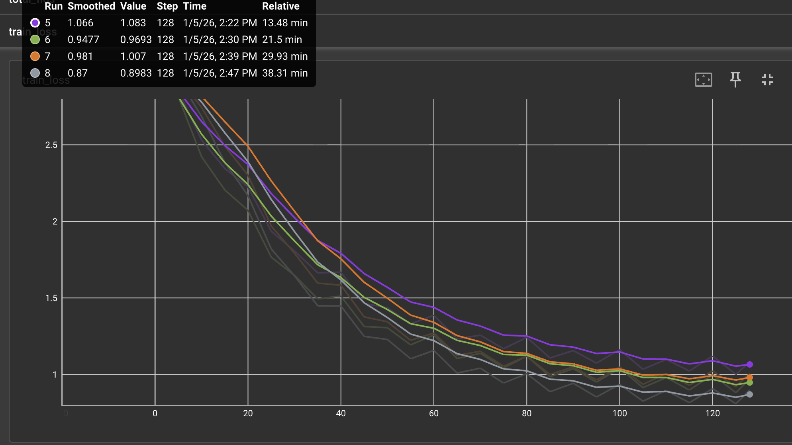
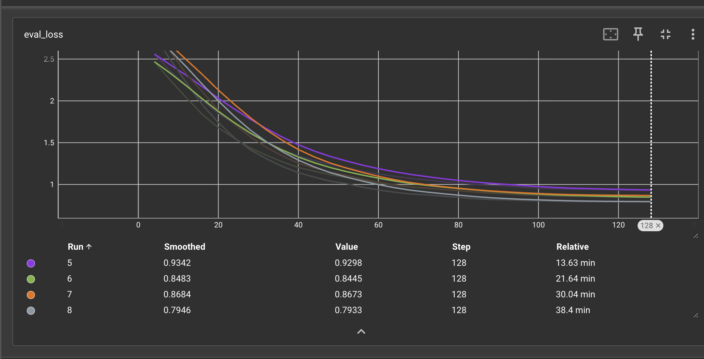
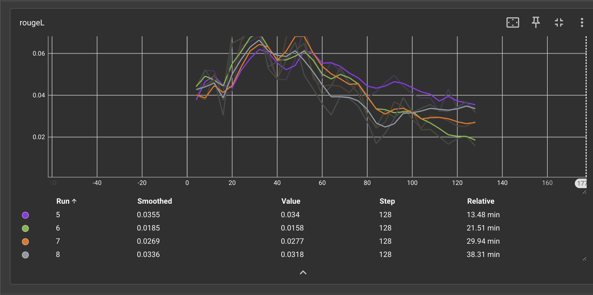

# GPT-2 SFT with RapidFireAI

Notebook: https://colab.research.google.com/drive/1nwNZhq_ZzirzEojIZTnw1bsxYJ2Ygajz?usp=sharing

Fine-tunes GPT-2 using Supervised Fine-Tuning (SFT) with LoRA adapters on a customer support chatbot dataset (Bitext). RapidFireAI was used to explore multiple hyperparameter and LoRA configurations, optimizing both token-level accuracy (eval loss) and sequence-level output quality (ROUGE-L).

---

## Results

Best Configuration (Config 1) at step 64:

| Metric | Value |
|--------|-------|
| Eval Loss (step 64) | 1.152 |
| ROUGE-L (step 64) | 0.05553 |
| Peak ROUGE-L (step 52) | 0.06156 |
| Train Loss (step 65) | 1.356 |

Step 64 selected because it balances token-level accuracy and sequence-level output quality, avoiding overfitting observed at later steps.

---

## Dataset

- Source: Bitext Customer Support Chatbot Dataset
- Training: 80 examples (shuffled)
- Evaluation: 20 examples (shuffled)

---

## Model and Experiment

- Base: GPT-2 (causal LM)
- LoRA applied to target modules: c_attn and c_proj
- Hyperparameters varied: rank (r), lora_alpha, lora_dropout, learning rate, scheduler type
- Training checkpoints evaluated with smoothed metrics for optimal early stopping

---

## Usage

Open the Colab notebook to run the experiments. Modify peft_params, training_args, or dataset paths to run new configurations. Metrics plots are viewable via TensorBoard in the notebook.
